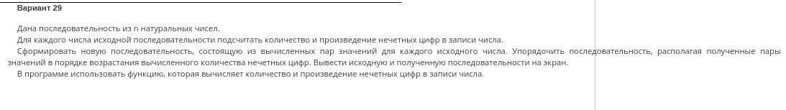
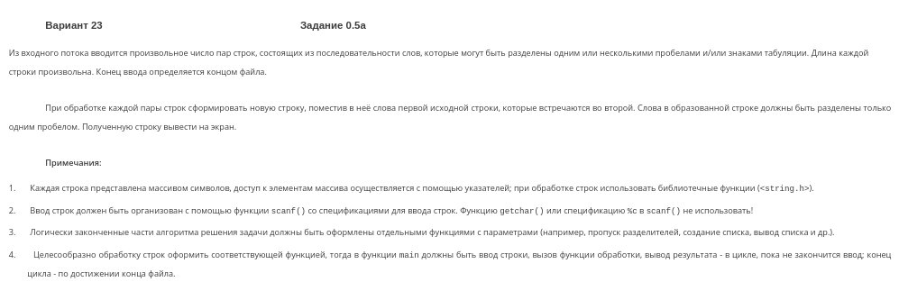
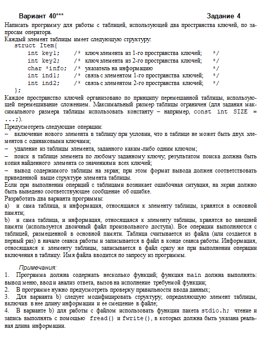
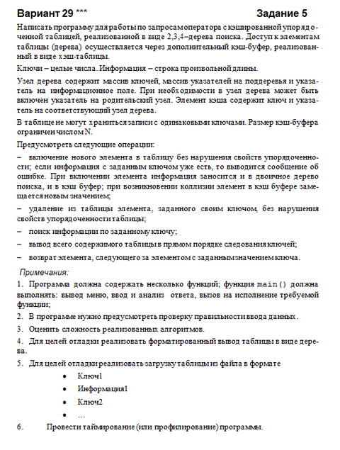
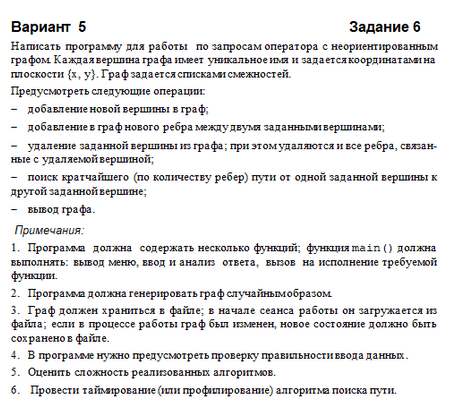

Labs and some libraries built during Algos and Data Structures course in my freshman year in MEPhI.

Numeration is a bit off and that's not my mistake.

### Lab 0

### Lab 1

### Lab 0.5

### Lab 3

### Lab 4

### Lab 5

