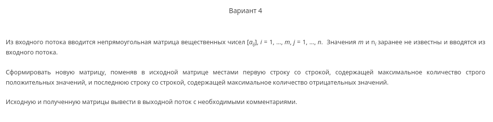

Labs and some libraries built during Algos and Data Structures course in my freshman year in MEPhI.

Numeration is a bit off and that's not my mistake.

## Lab specification
### Lab 0

### Lab 1

### Lab 0.5

### Lab 3

### Lab 4

### Lab 5

### Lab 6
Implement fast matrix multiplication algorithm (Strassen/Winograd). Strassen was chosen since it's more useable. Also tried to make multithreaded implementation and it seems to work, yay.

### Lab 7
Implement LLRB tree based on Sedgewick's 2008 paper. 

## Libraries 
### Tuilib 
A library built to simplify and unify terminal-like labs (3, 4, 5), which require some data structure alonside with console that executes some operations. Ops list is defined for every operation, specifying arguments, return type, callback function, etc. Callback function is a wrapper around actual function that unpacks `void**` array of arguments and passes them further.

### Utillib
Just some useful stuff like switchable debug output and safe `free()`.
